# sustentacion ejercicio MySQL

---

# 1. Normalizacion 

Se encuentran los comandos de la creacion de las tablas respetcivamente normalizadas en el archivo tablas.sql y los comandos de las consultas en 

# 2. Joins

primero quise hacer las inserciones a todas las tablas para poder concentrarme luego en las consultas, las inserciones fueron las siguientes:
```sql
INSERT INTO paises (pais_name) VALUES ('Colombia'),('Argentina');
INSERT INTO estados (estado_name, pais_id) VALUES ('Santander', 1),('Misiones',2);
INSERT INTO ciudades (ciudad_name, estado_id) VALUES ('Bogotá', 1),('estado x', 2);
INSERT INTO clientes (nombre, apellidos) VALUES ('Juan', 'Pérez'),('Ana ','Garcia'),('Angel','Pinzon'), ('Hector','Mejia');
INSERT INTO clientes_ubicacion (cliente_id, ciudad_id, direccion, codigo_postal, descripcion) VALUES (1, 1, 'Calle 123', '110111', 'Casa principal'),(2, 2, 'Av Reforma 456', '44100', 'Departamento');
INSERT INTO clientes_correo (cliente_id, email_name, email_type) VALUES (1, 'juan@example.com', 'personal'),(2, 'ana@example.com', 'trabajo');
INSERT INTO clientes_telefono (cliente_id, telefono, telefono_type, telefono_prefijo) VALUES (1, '3011234567', 'móvil', '+57'), (2, '3317654321', 'fijo', '+52');
INSERT INTO puestos (nombre_puesto) VALUES ('Vendedor'),('Administrador');
INSERT INTO empleados (puesto_id, nombre, salario, fecha_contratacion) VALUES (1, 'Carlos López', 3000.00, '2023-01-10'),(2, 'Luisa Fernández', 4500.00, '2022-06-15');
INSERT INTO datos_empleados (empleado_id, direccion, estado_civil) VALUES (1, 'Calle 10 Sur', 'Soltero'),(2, 'Av Central', 'Casado');
INSERT INTO datos_empleados_correo (datos_empleado_id, email_type, email_name) VALUES (1, 'corporativo', 'carlos@empresa.com'),(2, 'personal', 'luisa@personal.com');
INSERT INTO datos_empleados_telefono (datos_empleado_id, telefono, telefono_type, telefono_prefijo) VALUES (1, '3100000001', 'móvil', '+57'),(2, '5551002002', 'fijo', '+52');
INSERT INTO proveedores (nombre, direccion) VALUES ('Proveedor A', 'Cra 10 #20-30'),('Proveedor B', 'Av 15 #45-60');
INSERT INTO producto_tipo (nombre_tipo, descripcion) VALUES ('Electrónica', 'Productos electrónicos en general'),('Computadores', 'Laptops y PCs');
INSERT INTO jerarquia_tipos (tipo_id, padre_id) VALUES (2, 1);
INSERT INTO productos (proveedor_id, producto_tipo_id, nombre, precio) VALUES (1, 1, 'Audífonos', 120.00),(2, 2, 'Laptop Lenovo', 2300.00);
INSERT INTO pedidos (cliente_id, fecha, total, descripcion) VALUES (1, '2024-06-01', 2420.00, 'Compra en línea'),(2, '2024-06-02', 120.00, 'Compra física');
INSERT INTO pedidos_detalle (pedido_id, producto_id, cantidad, precio_unitario) VALUES (1, 2, 1, 2300.00),(1, 1, 1, 120.00),(2, 1, 1, 120.00);
INSERT INTO pedidos_historial (pedido_id, cambio_fecha, cambio_total, cambio_descripcion) VALUES (1, '2024-06-01 12:00:00', 2420.00, 'Compra registrada'),(2, '2024-06-02 13:00:00', 120.00, 'Pago en caja');
INSERT INTO proveedores_contacto (proveedor_id, contacto, tipo_contacto) VALUES (1, 'contactoA@proveedor.com', 'correo'),(2, 'contactoB@proveedor.com', 'correo');
INSERT INTO proveedores_telefono (proveedor_id, telefono, telefono_type, telefono_prefijo) VALUES (1, '3101112233', 'móvil', '+57'),(2, '3204445566', 'fijo', '+57');
INSERT INTO proveedores_empleados (empleado_id, proveedor_id) VALUES (1, 1),(2, 2); 
```

Estos ahora sí son los respectivos procedimientos de la parte de Joins:

### 1 
```sql 
SELECT 
  pedidos.id AS pedido_id,
  pedidos.fecha,
  pedidos.total,
  pedidos.descripcion,
  clientes.id AS cliente_id,
  clientes.nombre, 
  clientes.apellidos
FROM pedidos
INNER JOIN clientes ON pedidos.cliente_id = clientes.id;
```

### 2
```sql
SELECT productos.id AS id_producto,
productos.nombre,
proveedores.id as id_proveedor,
proveedores.nombre
FROM productos INNER JOIN proveedores ON productos.proveedor_id = proveedores.id;
```

### 3
```sql
SELECT 
  pedidos.id AS id_pedido,
  pedidos.fecha,
  pedidos.total,
  clientes.nombre AS nombre_cliente,
  clientes_ubicacion.direccion,
  clientes_ubicacion.codigo_postal
FROM pedidos
LEFT JOIN clientes ON pedidos.cliente_id = clientes.id
LEFT JOIN clientes_ubicacion ON clientes.id = clientes_ubicacion.cliente_id; 
```

### 4
```sql
-- esto para agregar una foreign key a pedidos y empleados y asi, poder relacionarlas
ALTER TABLE pedidos
ADD COLUMN empleado_id INT,
ADD CONSTRAINT fk_empleado_id_pedidos FOREIGN KEY (empleado_id) REFERENCES empleados(id);

-- insertar datos a pedidos para que un empleado registre un pedido 
INSERT INTO pedidos (cliente_id, fecha, total, descripcion, empleado_id)
VALUES (1, '2025-06-21', 300.00, 'Primer pedido de prueba', 1);

-- comando de la consulta 
SELECT 
  empleados.id AS id_empleado,
  empleados.nombre,
  pedidos.id AS id_pedido,
  pedidos.fecha,
  pedidos.total
FROM empleados 
LEFT JOIN pedidos ON pedidos.empleado_id = empleados.id;
```

### 5 
```sql
SELECT 
  producto_tipo.id AS id_tipo,
  producto_tipo.nombre_tipo,
  productos.id AS id_producto,
  productos.nombre,
  productos.precio 
FROM producto_tipo
INNER JOIN productos ON productos.producto_tipo_id = producto_tipo.id;
```

### 6
```sql
-- group devuelve el numero de filas de un criterio
-- se usa left join para que aparezcan tambien los clientes con o sin pedidos
-- este comando se usa de esta forma ya que de otra me hubiera dado el error 'sql_mode=only_full_group_by'
SELECT 
  clientes.id AS cliente_id,
  clientes.nombre,
  clientes.apellidos,
COUNT(pedidos.id) AS total_pedidos
FROM clientes
LEFT JOIN pedidos ON pedidos.cliente_id = clientes.id
GROUP BY clientes.id, clientes.nombre, clientes.apellidos;
```


### 7
```sql
SELECT 
  pedidos.id AS id_pedido,
  pedidos.fecha,
  pedidos.total,
  empleados.nombre
FROM pedidos 
INNER JOIN empleados ON empleados.id = pedidos.empleado_id;
```


### 8
```sql
-- EN este caso nos da un empty set ya que no hay ningun registro de un producto que no haya sido pedido
SELECT
  productos.id AS id_producto,
  productos.nombre,
  productos.precio,
  pedidos_detalle.producto_id,
  pedidos_detalle.pedido_id
FROM pedidos_detalle
RIGHT JOIN productos ON pedidos_detalle.producto_id = productos.id
WHERE pedidos_detalle.producto_id IS NULL;
```


### 9 
```sql
SELECT 
  pedidos.id AS id_pedido,
  pedidos.fecha,
  pedidos.total,
  clientes.id AS id_cliente,
  clientes.nombre,
  clientes.apellidos,
  clientes_ubicacion.direccion,
  ciudades.ciudad_name,
  estados.estado_name,
  paises.pais_name
FROM pedidos
INNER JOIN clientes ON pedidos.cliente_id = clientes.id
LEFT JOIN clientes_ubicacion ON clientes_ubicacion.cliente_id = clientes.id
LEFT JOIN ciudades ON ciudades.id = clientes_ubicacion.ciudad_id
LEFT JOIN estados ON estados.id = ciudades.estado_id
LEFT JOIN paises ON paises.id = estados.pais_id;
```


### 10
```sql
SELECT 
  productos.id AS id_producto,
  productos.nombre,
  productos.precio,
  proveedores.id AS id_proveedor,
  proveedores.nombre, 
  proveedores.direccion,
  producto_tipo.nombre_tipo
FROM productos
INNER JOIN proveedores ON productos.proveedor_id = proveedores.id 
INNER JOIN producto_tipo ON productos.producto_tipo_id = producto_tipo.id;
```

# Consultas simples

### 11
```sql
-- selecciona todos los elementos de productos con el precio mayor a 50 dolares 
SELECT * FROM productos WHERE precio > 50;
```


### 12
```sql
-- solamente hay una persona que vive en Bogotá
SELECT clientes.id AS id_cliente,
  clientes.nombre,
  clientes.apellidos,  
  clientes_ubicacion.ciudad_id AS id_ciudad,
  ciudades.ciudad_name
FROM clientes 
INNER JOIN clientes_ubicacion ON clientes.id = clientes_ubicacion.cliente_id
INNER JOIN ciudades ON clientes_ubicacion.ciudad_id = ciudades.id
WHERE ciudades.ciudad_name = 'Bogotá';
```


### 13
```sql
-- inserta un empleado contratado actualmente
INSERT empleados(nombre, salario, fecha_contratacion) VALUES ('Juanito Perez', 2500.00, '2024-10-16');

SELECT empleados.id AS id_empleado,
  empleados.nombre,
  empleados.salario,
  empleados.fecha_contratacion
FROM empleados
WHERE fecha_contratacion > '2023-06-22';
```
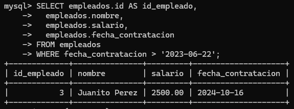

### 14
```sql
-- insertar varios productos para un proveedor
INSERT INTO productos (proveedor_id, producto_tipo_id, nombre, precio) VALUES (1, 2, 'Teclado', 50.00), (1, 2, 'Mouse', 25.00), (1, 2, 'Monitor', 200.00), (1, 2, 'CPU', 500.00), (1, 2, 'Impresora', 150.00), (1, 2, 'Parlantes', 80.00);

-- el uso de having es necesario ya que el where no sirve con funciones agregadas como count. Y el group by se usa por el mismo error de sql_mode=only_full_group_by
SELECT proveedores.id,
  proveedores.nombre,
  COUNT(productos.id) AS total_productos
FROM proveedores
JOIN productos ON proveedores.id = productos.proveedor_id
GROUP BY proveedores.id, proveedores.nombre
HAVING COUNT(productos.id) > 5;
```

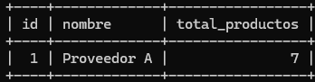

### 15
```sql
-- ingresar un cliente sin direccion 
INSERT INTO clientes(nombre, apellidos) VALUES ('fabio', 'camelo');

-- sale null porque estos clientes no tienen direccion
SELECT 
  clientes.id AS id_cliente,
  clientes.nombre,
  clientes.apellidos,
  clientes_ubicacion.direccion
FROM clientes
LEFT JOIN clientes_ubicacion ON clientes.id = clientes_ubicacion.cliente_id
WHERE clientes_ubicacion.id IS NULL;
```

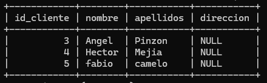

### 16
```sql
-- en este caso se usa la funcion reservada de sum para poder sumar el total de cada cliente teniendo en cuenta su pedido y porque vuelve a salir el error de sql_mode=only_full_group_by
SELECT 
  clientes.id AS id_cliente,
  clientes.nombre,
  clientes.apellidos,
  SUM(pedidos.total) AS total_ventas
FROM clientes
INNER JOIN pedidos ON clientes.id = pedidos.cliente_id
GROUP BY clientes.id, clientes.nombre, clientes.apellidos;
```
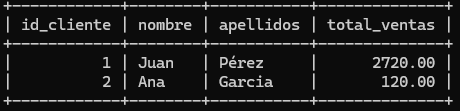

### 17
```sql
SELECT AVG(salario) AS promedio_salario FROM empleados;
```

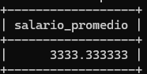

### 18
```sql
-- listar productos con su respectivo tipo
SELECT 
  producto_tipo.id AS id_tipo,
  producto_tipo.nombre_tipo,
  producto_tipo.descripcion,
  productos.nombre,
  productos.precio
FROM producto_tipo
INNER JOIN productos ON producto_tipo.id = productos.producto_tipo_id;
```

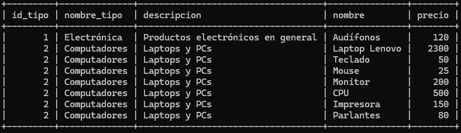

### 19
```sql
SELECT 
  id AS id_producto,
  nombre,
  precio
FROM productos
ORDER BY precio DESC
LIMIT 3;
```
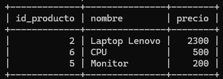

### 20
```sql
-- se cuental los pedidos con count id, se agrupa la consulta por clientes, se ordena de orden ascencidente de acuerdo al numero de pedidos por cliente y se muestra el primero, es decir, el que mas pedidos tiene 
SELECT 
  clientes.id AS id_cliente,
  clientes.nombre,
  clientes.apellidos,
  COUNT(pedidos.id) AS total_pedidos
FROM clientes
INNER JOIN pedidos ON clientes.id = pedidos.cliente_id
GROUP BY clientes.id, clientes.nombre, clientes.apellidos
ORDER BY total_pedidos DESC
LIMIT 1;
```

# Consultas multitabla 

### 21
```sql
-- relacionar pedidos con clientes
SELECT 
  pedidos.id AS id_pedido,
  pedidos.fecha,
  pedidos.total,
  clientes.id AS id_cliente,
  clientes.nombre,
  clientes.apellidos
FROM pedidos
INNER JOIN clientes ON pedidos.cliente_id = clientes.id;
```


### 22
```sql
-- hacer join con las tablas de clientes, clientes_ubicacion, ciudades, estados y paises con pedidos.
SELECT 
  pedidos.id AS id_pedido,
  pedidos.fecha,
  pedidos.total,
  pedidos.descripcion,
  clientes.nombre,
  clientes_ubicacion.direccion,
  ciudades.ciudad_name,
  estados.estado_name,
  paises.pais_name
FROM pedidos
INNER JOIN clientes ON pedidos.cliente_id = clientes.id
INNER JOIN clientes_ubicacion ON clientes.id = clientes_ubicacion.cliente_id
INNER JOIN ciudades ON clientes_ubicacion.ciudad_id = ciudades.id
INNER JOIN estados ON ciudades.estado_id = estados.id
INNER JOIN paises ON estados.pais_id = paises.id;
```

### 23
```sql
-- relacionar productos con prveedores y producto_tipo
SELECT 
  productos.id AS id_producto,
  productos.nombre,
  productos.precio,
  proveedores.id AS proveedor_id,
  proveedores.nombre AS proveedor_nombre,
  producto_tipo.nombre_tipo
FROM productos
INNER JOIN proveedores ON productos.proveedor_id = proveedores.id
INNER JOIN producto_tipo ON productos.producto_tipo_id = producto_tipo.id;
```

### 24
```sql
-- para este comando se requiere añadir una relacion entre empleados y pedidos cosa que ya se hizo en los comandos anteriores.

-- se tiene que hacer el JOIN con todas esas tablas para filtrar el pedido realizado por un cliente en una ciudad especifica 
SELECT 
  empleados.id AS id_empleado, 
  empleados.nombre
FROM empleados
INNER JOIN pedidos ON empleados.id = pedidos.empleado_id
INNER JOIN clientes ON pedidos.cliente_id = clientes.id
INNER JOIN clientes_ubicacion ON clientes.id = clientes_ubicacion.cliente_id
INNER JOIN ciudades ON clientes_ubicacion.ciudad_id = ciudades.id
WHERE ciudades.ciudad_name = 'Bogotá';
```


### 25
```sql
-- en este caso solo muestra 2 resultados porque solo hay 2 productos vendidos
SELECT 
  productos.id,
  productos.nombre,
  SUM(pedidos_detalle.cantidad) AS total_vendidos
FROM productos
INNER JOIN pedidos_detalle ON productos.id = pedidos_detalle.producto_id
GROUP BY productos.id, productos.nombre
ORDER BY total_vendidos DESC
LIMIT 5;
```

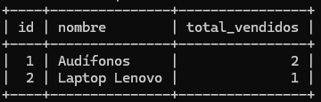
### 26
```sql
-- GROUP BY porque toca agrupar la cantidad total de pedidos por cliente y ciudad
SELECT 
  clientes.id AS id_cliente,
  clientes.nombre,
  COUNT(pedidos.id) AS total_pedidos,
  ciudades.ciudad_name,
  estados.estado_name,
  paises.pais_name
FROM clientes
INNER JOIN pedidos ON clientes.id = pedidos.cliente_id
INNER JOIN clientes_ubicacion ON clientes.id = clientes_ubicacion.cliente_id
INNER JOIN ciudades ON clientes_ubicacion.ciudad_id = ciudades.id
INNER JOIN estados ON ciudades.estado_id = estados.id
INNER JOIN paises ON estados.pais_id = paises.id
GROUP BY clientes.id, ciudades.id;
```
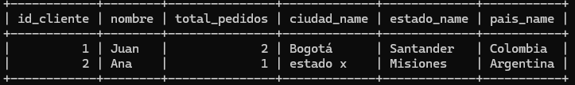
### 27
```sql
-- para poder ejecutar este comando correctamente toca asignar una ciudad para proveedores y para ello se necesita volver a normalizar las tablas 
SELECT 
  clientes.nombre AS nombre_cliente,
  proveedores.nombre AS nombre_proveedor,
  ciudades.ciudad_name
FROM clientes
INNER JOIN clientes_ubicacion ON clientes.id = clientes_ubicacion.cliente_id
INNER JOIN ciudades ON clientes_ubicacion.ciudad_id = ciudades.id
INNER JOIN proveedores ON proveedores.direccion LIKE CONCAT('%', ciudades.ciudad_name, '%');
```
### 28
```sql
-- se realiza la multiplicacion por la cantidad de productos con el precio unitario
SELECT 
  producto_tipo.id AS id_tipo,
  producto_tipo.nombre_tipo,
  SUM(pedidos_detalle.cantidad * pedidos_detalle.precio_unitario) AS total_ventas
FROM producto_tipo
INNER JOIN productos ON producto_tipo.id = productos.producto_tipo_id
INNER JOIN pedidos_detalle ON productos.id = pedidos_detalle.producto_id
GROUP BY producto_tipo.nombre_tipo;
```
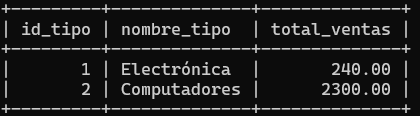
### 29
```sql
-- se muestra vacio ya que no hay inserts que cumplan con esa consulta 
SELECT  
  empleados.id, empleados.nombre
FROM empleados
INNER JOIN pedidos ON empleados.id = pedidos.empleado_id
INNER JOIN pedidos_detalle ON pedidos.id = pedidos_detalle.pedido_id
INNER JOIN productos ON pedidos_detalle.producto_id = productos.id
INNER JOIN proveedores ON productos.proveedor_id = proveedores.id
WHERE proveedores.nombre = 'Proveedor B';
```

### 30
```sql
SELECT 
  proveedores.id AS id_proveedor,
  proveedores.nombre,
  SUM(pedidos_detalle.cantidad * pedidos_detalle.precio_unitario) AS ingreso_total
FROM proveedores
INNER JOIN productos ON proveedores.id = productos.proveedor_id
INNER JOIN pedidos_detalle ON productos.id = pedidos_detalle.producto_id
GROUP BY proveedores.id, proveedores.nombre;
```
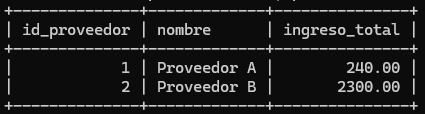