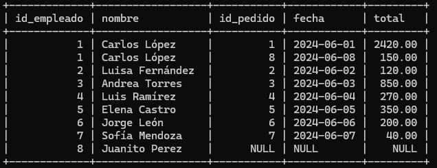
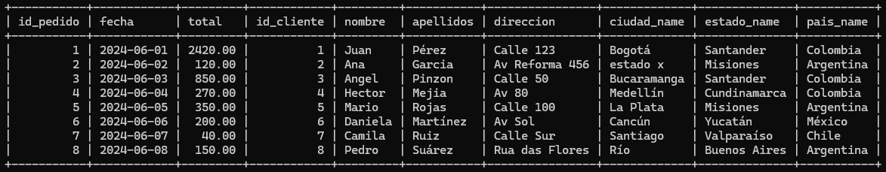
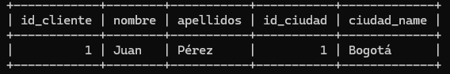
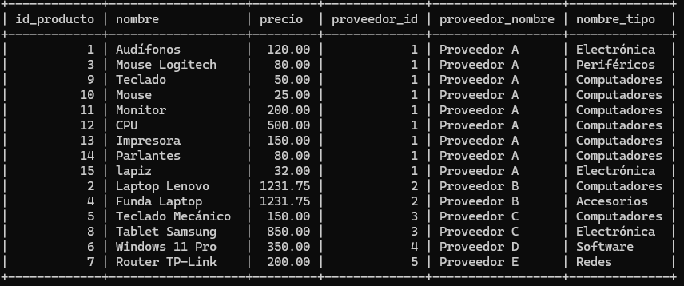

# sustentacion ejercicio MySQL
## 1. Normalizacion 

Se encuentran los comandos de la creacion de las tablas respetcivamente normalizadas en el archivo tablas.sql y los comandos de las consultas en [Tablas MySQL](./tablas-normalizacion.sql).

A su vez, en este archivo se encuentran todos los inserts realizados en la base de datos para poder sacar las consultas requeridas y los ejercicios propuestos. [Inserts](./insert.sql)

## 2. Joins
Estos ahora sí son los respectivos procedimientos de la parte de Joins:

### 1 
```sql 
-- Obtener la lista de todos los pedidos con los nombres de clientes usando INNER JOIN 
SELECT 
  pedidos.id AS pedido_id,
  pedidos.fecha,
  pedidos.total,
  pedidos.descripcion,
  clientes.id AS cliente_id,
  clientes.nombre, 
  clientes.apellidos
FROM pedidos
INNER JOIN clientes ON pedidos.cliente_id = clientes.id;
```

### 2
```sql
-- Listar los productos y proveedores que los suministran con INNER JOIN .
SELECT productos.id AS id_producto,
  productos.nombre AS producto_nombre,
  proveedores.id as id_proveedor,
  proveedores.nombre AS proveedor_nombre
FROM productos INNER JOIN proveedores ON productos.proveedor_id = proveedores.id;
```

### 3
```sql
-- Mostrar los pedidos y las ubicaciones de los clientes con LEFT JOIN 
SELECT 
  pedidos.id AS id_pedido,
  pedidos.fecha,
  pedidos.total,
  clientes.nombre AS nombre_cliente,
  clientes_ubicacion.direccion,
  clientes_ubicacion.codigo_postal
FROM pedidos
LEFT JOIN clientes ON pedidos.cliente_id = clientes.id
LEFT JOIN clientes_ubicacion ON clientes.id = clientes_ubicacion.cliente_id;
```


### 4
```sql
-- Consultar los empleados que han registrado pedidos, incluyendo empleados sin pedidos ( LEFT JOIN ).
SELECT 
  empleados.id AS id_empleado,
  empleados.nombre,
  pedidos.id AS id_pedido,
  pedidos.fecha,
  pedidos.total
FROM empleados 
LEFT JOIN pedidos ON pedidos.empleado_id = empleados.id;
```

### 5 
```sql
-- Obtener el tipo de producto y los productos asociados con INNER JOIN .
SELECT 
  producto_tipo.id AS id_tipo,
  producto_tipo.nombre_tipo,
  productos.id AS id_producto,
  productos.nombre,
  productos.precio 
FROM producto_tipo
INNER JOIN productos ON productos.producto_tipo_id = producto_tipo.id;
```

### 6
```sql
-- Listar todos los clientes y el número de pedidos realizados con COUNT y GROUP BY .
SELECT 
  clientes.id AS cliente_id,
  clientes.nombre,
  clientes.apellidos,
COUNT(pedidos.id) AS total_pedidos
FROM clientes
LEFT JOIN pedidos ON pedidos.cliente_id = clientes.id
GROUP BY clientes.id, clientes.nombre, clientes.apellidos;
```


### 7
```sql
-- Combinar Pedidos y Empleados para mostrar qué empleados gestionaron pedidos específicos.
SELECT 
  pedidos.id AS id_pedido,
  pedidos.fecha,
  pedidos.total,
  empleados.nombre
FROM pedidos 
INNER JOIN empleados ON empleados.id = pedidos.empleado_id;
```

### 8
```sql
-- Mostrar productos que no han sido pedidos ( RIGHT JOIN ).
SELECT
  productos.id AS id_producto,
  productos.nombre,
  productos.precio,
  pedidos_detalle.producto_id,
  pedidos_detalle.pedido_id
FROM pedidos_detalle
RIGHT JOIN productos ON pedidos_detalle.producto_id = productos.id
WHERE pedidos_detalle.producto_id IS NULL;
```


### 9 
```sql
-- Mostrar el total de pedidos y ubicación de clientes usando múltiples JOIN .
SELECT 
  pedidos.id AS id_pedido,
  pedidos.fecha,
  pedidos.total,
  clientes.id AS id_cliente,
  clientes.nombre,
  clientes.apellidos,
  clientes_ubicacion.direccion,
  ciudades.ciudad_name,
  estados.estado_name,
  paises.pais_name
FROM pedidos
INNER JOIN clientes ON pedidos.cliente_id = clientes.id
INNER JOIN clientes_ubicacion ON clientes_ubicacion.cliente_id = clientes.id
INNER JOIN ciudades ON ciudades.id = clientes_ubicacion.ciudad_id
INNER JOIN estados ON estados.id = ciudades.estado_id
INNER JOIN paises ON paises.id = estados.pais_id;
```


### 10
```sql
-- Unir Proveedores , Productos , y TiposProductos para un listado completo de inventario.
SELECT 
  productos.id AS id_producto,
  productos.nombre,
  productos.precio,
  proveedores.id AS id_proveedor,
  proveedores.nombre, 
  proveedores.direccion,
  producto_tipo.nombre_tipo
FROM productos
INNER JOIN proveedores ON productos.proveedor_id = proveedores.id 
INNER JOIN producto_tipo ON productos.producto_tipo_id = producto_tipo.id;
```

## Consultas simples

### 1
```sql
-- Seleccionar todos los productos con precio mayor a $50
SELECT * FROM productos WHERE precio > 50;
```

### 2
```sql
-- Consultar clientes registrados en una ciudad específica.
SELECT clientes.id AS id_cliente,
  clientes.nombre,
  clientes.apellidos,  
  clientes_ubicacion.ciudad_id AS id_ciudad,
  ciudades.ciudad_name
FROM clientes 
INNER JOIN clientes_ubicacion ON clientes.id = clientes_ubicacion.cliente_id
INNER JOIN ciudades ON clientes_ubicacion.ciudad_id = ciudades.id
WHERE ciudades.ciudad_name = 'Bogotá';
```


### 3
```sql
-- Mostrar empleados contratados en los últimos 2 años
SELECT empleados.id AS id_empleado,
  empleados.nombre,
  empleados.salario,
  empleados.fecha_contratacion
FROM empleados
WHERE fecha_contratacion > '2023-06-22';
```


### 4
```sql
-- Seleccionar proveedores que suministran más de 5 productos.
-- el uso de having es necesario ya que el where no sirve con funciones agregadas como count. Y el group by se usa por el mismo error de sql_mode=only_full_group_by
SELECT proveedores.id,
  proveedores.nombre,
  COUNT(productos.id) AS total_productos
FROM proveedores
JOIN productos ON proveedores.id = productos.proveedor_id
GROUP BY proveedores.id, proveedores.nombre
HAVING COUNT(productos.id) > 5;
```

### 5
```sql
-- Listar clientes que no tienen dirección registrada en UbicacionCliente .
SELECT 
  clientes.id AS id_cliente,
  clientes.nombre,
  clientes.apellidos,
  clientes_ubicacion.direccion
FROM clientes
LEFT JOIN clientes_ubicacion ON clientes.id = clientes_ubicacion.cliente_id
WHERE clientes_ubicacion.id IS NULL;
```

### 6
```sql
-- Calcular el total de ventas por cada cliente.
-- en este caso se usa la funcion reservada de sum para poder sumar el total de cada cliente teniendo en cuenta su pedido y porque vuelve a salir el error de sql_mode=only_full_group_by
SELECT 
  clientes.id AS id_cliente,
  clientes.nombre,
  clientes.apellidos,
  SUM(pedidos.total) AS total_ventas
FROM clientes
INNER JOIN pedidos ON clientes.id = pedidos.cliente_id
GROUP BY clientes.id, clientes.nombre, clientes.apellidos;
```


### 7
```sql
-- Mostrar el salario promedio de los empleados.
-- promedio de salario de todos los empleados de la empresa 
SELECT AVG(salario) AS promedio_salario FROM empleados;
```


### 8
```sql
-- Consultar el tipo de productos disponibles en TiposProductos
SELECT 
  producto_tipo.id AS id_tipo,
  producto_tipo.nombre_tipo,
  producto_tipo.descripcion,
  productos.nombre,
  productos.precio
FROM producto_tipo
INNER JOIN productos ON producto_tipo.id = productos.producto_tipo_id;
```


### 9
```sql
-- Seleccionar los 3 productos más caros.
-- para este caso se debe de usar el ORDER BY para ordernar de acuerdo al precio de los productos y el LIMIT para que solo aparezcan los 3 con mayor valor.
SELECT 
  id AS id_producto,
  nombre,
  precio
FROM productos
ORDER BY precio DESC
LIMIT 3;
```


### 10
```sql
-- Consultar el cliente con el mayor número de pedidos.
-- se cuentan los pedidos con count id, se agrupa la consulta por clientes, se ordena de orden ascencidente de acuerdo al numero de pedidos por cliente y se muestra el primero, es decir, el que mas pedidos tiene 
SELECT 
  clientes.id AS id_cliente,
  clientes.nombre,
  clientes.apellidos,
  COUNT(pedidos.id) AS total_pedidos
FROM clientes
INNER JOIN pedidos ON clientes.id = pedidos.cliente_id
GROUP BY clientes.id, clientes.nombre, clientes.apellidos
ORDER BY total_pedidos DESC
LIMIT 1;
```

## Consultas multitabla 
### 1
```sql
-- Listar todos los pedidos y el cliente asociado.
-- relacionar pedidos con clientes
SELECT 
  pedidos.id AS id_pedido,
  pedidos.fecha,
  pedidos.total,
  clientes.id AS id_cliente,
  clientes.nombre,
  clientes.apellidos
FROM pedidos
INNER JOIN clientes ON pedidos.cliente_id = clientes.id;
```

### 2
```sql
-- Mostrar la ubicación de cada cliente en sus pedidos.
-- hacer join con las tablas de clientes, clientes_ubicacion, ciudades, estados y paises con pedidos.
SELECT 
  pedidos.id AS id_pedido,
  pedidos.fecha,
  pedidos.total,
  pedidos.descripcion,
  clientes.nombre,
  clientes_ubicacion.direccion,
  ciudades.ciudad_name,
  estados.estado_name,
  paises.pais_name
FROM pedidos
INNER JOIN clientes ON pedidos.cliente_id = clientes.id
INNER JOIN clientes_ubicacion ON clientes.id = clientes_ubicacion.cliente_id
INNER JOIN ciudades ON clientes_ubicacion.ciudad_id = ciudades.id
INNER JOIN estados ON ciudades.estado_id = estados.id
INNER JOIN paises ON estados.pais_id = paises.id;
```


### 3
```sql
-- Listar productos junto con el proveedor y tipo de producto.
-- relacionar productos con proveedores y producto_tipo
SELECT 
  productos.id AS id_producto,
  productos.nombre,
  productos.precio,
  proveedores.id AS proveedor_id,
  proveedores.nombre AS proveedor_nombre,
  producto_tipo.nombre_tipo
FROM productos
INNER JOIN proveedores ON productos.proveedor_id = proveedores.id
INNER JOIN producto_tipo ON productos.producto_tipo_id = producto_tipo.id;
```


### 4
```sql
-- Consultar todos los empleados que gestionan pedidos de clientes en una ciudad específica.
-- se tiene que hacer el JOIN con todas esas tablas para filtrar el pedido realizado por un cliente en una ciudad especifica 
SELECT 
  empleados.id AS id_empleado, 
  empleados.nombre
FROM empleados
INNER JOIN pedidos ON empleados.id = pedidos.empleado_id
INNER JOIN clientes ON pedidos.cliente_id = clientes.id
INNER JOIN clientes_ubicacion ON clientes.id = clientes_ubicacion.cliente_id
INNER JOIN ciudades ON clientes_ubicacion.ciudad_id = ciudades.id
WHERE ciudades.ciudad_name = 'Bogotá';
```

### 5
```sql
-- Consultar los 5 productos más vendidos.
-- listar los 5 productos mas vendidos, la misma logica que en el ejercicio 19. Otra vez el GROUP BY por el sql_mode=only_full_group_by
  SELECT 
    productos.id,
    productos.nombre,
    SUM(pedidos_detalle.cantidad) AS total_vendidos
  FROM productos
  INNER JOIN pedidos_detalle ON productos.id = pedidos_detalle.producto_id
  GROUP BY productos.id, productos.nombre
  ORDER BY total_vendidos DESC
  LIMIT 5;
```

### 6
```sql
-- Obtener la cantidad total de pedidos por cliente y ciudad.
-- GROUP BY porque toca agrupar la cantidad total de pedidos por cliente y ciudad
SELECT 
  clientes.id AS id_cliente,
  clientes.nombre,
  COUNT(pedidos.id) AS total_pedidos,
  ciudades.ciudad_name,
  estados.estado_name,
  paises.pais_name
FROM clientes
INNER JOIN pedidos ON clientes.id = pedidos.cliente_id
INNER JOIN clientes_ubicacion ON clientes.id = clientes_ubicacion.cliente_id
INNER JOIN ciudades ON clientes_ubicacion.ciudad_id = ciudades.id
INNER JOIN estados ON ciudades.estado_id = estados.id
INNER JOIN paises ON estados.pais_id = paises.id
GROUP BY clientes.id, ciudades.id;
```


### 7
```sql
-- Listar clientes y proveedores en la misma ciudad.
SELECT 
  c.nombre AS nombre_cliente,
  p.nombre AS nombre_proveedor,
  ciudades.ciudad_name
FROM clientes AS c
INNER JOIN clientes_ubicacion ON c.id = clientes_ubicacion.cliente_id
INNER JOIN ciudades ON clientes_ubicacion.ciudad_id = ciudades.id
INNER JOIN proveedores AS p ON p.ciudad_id = ciudades.id;
```


### 8
```sql
-- Mostrar el total de ventas agrupado por tipo de producto
-- se realiza la multiplicacion por la cantidad de productos con el precio unitario
SELECT 
  producto_tipo.id AS id_tipo,
  producto_tipo.nombre_tipo,
  SUM(pedidos_detalle.cantidad * pedidos_detalle.precio_unitario) AS total_ventas
FROM producto_tipo
INNER JOIN productos ON producto_tipo.id = productos.producto_tipo_id
INNER JOIN pedidos_detalle ON productos.id = pedidos_detalle.producto_id
GROUP BY producto_tipo.nombre_tipo;
```


### 9
```sql
-- Listar empleados que gestionan pedidos de productos de un proveedor específico.
SELECT  
  empleados.id, empleados.nombre
FROM empleados
INNER JOIN pedidos ON empleados.id = pedidos.empleado_id
INNER JOIN pedidos_detalle ON pedidos.id = pedidos_detalle.pedido_id
INNER JOIN productos ON pedidos_detalle.producto_id = productos.id
INNER JOIN proveedores ON productos.proveedor_id = proveedores.id
WHERE proveedores.nombre = 'Proveedor B';
```


### 10
```sql
-- Obtener el ingreso total de cada proveedor a partir de los productos vendidos
SELECT 
  proveedores.id AS id_proveedor,
  proveedores.nombre,
  SUM(pedidos_detalle.cantidad * pedidos_detalle.precio_unitario) AS ingreso_total
FROM proveedores
INNER JOIN productos ON proveedores.id = productos.proveedor_id
INNER JOIN pedidos_detalle ON productos.id = pedidos_detalle.producto_id
GROUP BY proveedores.id, proveedores.nombre;
```

## SUBCONSULTAS
### 1
```sql
-- Consultar el producto más caro en cada categoría.
SELECT p.id AS producto_id, 
p.nombre AS producto_nombre,
p.precio,
pt.nombre_tipo
FROM productos AS p 
INNER JOIN producto_tipo AS pt ON p.producto_tipo_id = pt.id
WHERE p.precio = (
  SELECT MAX(p2.precio)
  FROM productos AS p2 
  WHERE p2.producto_tipo_id = p.producto_tipo_id
)
;
```


### 2
```sql
SELECT c.id AS cliente_id,
c.nombre,
COUNT(p.id) AS total_pedidos
FROM clientes AS c
JOIN pedidos AS p ON c.id = p.cliente_id
GROUP BY c.id, c.nombre
HAVING COUNT(p.id) = (
  SELECT MAX(contador)
  FROM (
    SELECT COUNT(*) AS contador
    FROM pedidos
    GROUP BY cliente_id
  ) AS sub
);
```


### 3
```sql
SELECT e.id, 
e.nombre,
e.salario
FROM empleados AS e 
WHERE e.salario > ( 
  SELECT AVG(e2.salario)
  FROM empleados AS e2
)
;
```


### 4
```sql
-- Consultar productos que han sido pedidos más de 5 veces.
SELECT p.id,
p.nombre,
(
  SELECT SUM(pd.cantidad)
  FROM pedidos_detalle AS pd
  WHERE pd.producto_id = p.id
) AS total_veces_pedido
FROM productos AS p
WHERE (
  SELECT SUM(pd.cantidad)
  FROM pedidos_detalle AS pd
  WHERE pd.producto_id = p.id
) > 5;
```

### 5
```sql
-- Listar pedidos cuyo total es mayor al promedio de todos los pedidos.
SELECT p.id, 
p.fecha,
p.total
FROM pedidos AS p 
WHERE p.total > (
  SELECT AVG(p2.total)
  FROM pedidos AS p2 
);
```

### 6
```sql
-- Seleccionar los 3 proveedores con más productos.
SELECT 
  proveedores.id AS id_proveedor,
  proveedores.nombre AS nombre_proveedor,
  (
    SELECT COUNT(*) 
    FROM productos AS p 
    WHERE p.proveedor_id = proveedores.id
  ) AS total_productos
FROM proveedores
WHERE proveedores.id IN (
  SELECT proveedor_id
  FROM (
    SELECT proveedor_id, COUNT(*) AS total
    FROM productos
    GROUP BY proveedor_id
    ORDER BY total DESC
    LIMIT 3
  ) AS top_proveedores
);
```


### 7
```sql
-- Consultar productos con precio superior al promedio en su tipo.
SELECT p.id, 
p.nombre,
p.precio,
pt.nombre_tipo
FROM productos AS p
INNER JOIN producto_tipo AS pt ON p.producto_tipo_id = pt.id 
WHERE p.precio > (
  SELECT AVG(p2.precio)
  FROM productos AS p2 
  WHERE p2.producto_tipo_id = p.producto_tipo_id
);
```


### 8
```sql
-- Mostrar clientes que han realizado más pedidos que la media.
SELECT c.id AS cliente_id,
c.nombre,
COUNT(p.id) AS total_pedidos
FROM clientes AS c
LEFT JOIN pedidos AS p ON c.id = p.cliente_id
GROUP BY c.id, c.nombre
HAVING COUNT(p.id) > (
  SELECT AVG(total)
  FROM (
    SELECT COUNT(*) AS total
    FROM pedidos
    GROUP BY cliente_id
  ) AS sub
);
```


### 9
```sql
-- Encontrar productos cuyo precio es mayor que el promedio de todos los productos.
SELECT p.id,
p.nombre,
p.precio
FROM productos AS p 
WHERE p.precio > (
  SELECT AVG(p2.precio)
  FROM productos AS p2 
);
```


### 10
```sql
-- Mostrar empleados cuyo salario es menor al promedio del departamento.
-- no comprendí bien si la logica si departamento se refería al cargo del empleados o al departamentos (Santander) en el que vive.
SELECT e.id, 
e.nombre,
e.salario
FROM empleados AS e 
WHERE e.salario < (
  SELECT AVG(e2.salario)
  FROM empleados AS e2 
  WHERE e2.puesto_id = e.puesto_id 
);
```

## PROCEDIMIENTOS ALMACENADOS
### 1
```sql
-- Crear un procedimiento para actualizar el precio de todos los productos de un proveedor.
DELIMITER $$

CREATE PROCEDURE update_price_3(
  IN p_proveedor_id INT,
  IN p_nuevo_precio DECIMAL(10,2)
)
BEGIN
  DECLARE mensaje VARCHAR(80);

  UPDATE productos 
  SET precio = p_nuevo_precio
  WHERE proveedor_id = p_proveedor_id;

  IF ROW_COUNT() > 0 THEN
    SET mensaje = 'Registro actualizado correctamente';
  ELSE
    SET mensaje = 'Error al actualizar el precio';
  END IF;

  SELECT mensaje AS Mensaje;
END $$

DELIMITER ;

CALL update_price_3(2, 1231.75);
```


### 2
```sql
DELIMITER $$

CREATE PROCEDURE direction_output(
  IN d_cliente_id INT,
  OUT d_direccion VARCHAR(80)
)
BEGIN 
  DECLARE mensaje VARCHAR(80);

  SELECT direccion INTO d_direccion
  FROM clientes_ubicacion
  WHERE cliente_id = d_cliente_id;

  IF ROW_COUNT() > 0 THEN
    SET mensaje = 'Registro sacado correctamente';
  ELSE
    SET mensaje = 'Error al sacar el registro';
  END IF;

  SELECT mensaje AS Mensaje;
END $$

DELIMITER ;

-- hace que direccion sea una variable con el valor d_direccion que se pueda devolver con el select
CALL direction_output(2, @direccion);
SELECT @direccion AS Direccion;
```


### 3
```sql
DELIMITER $$

CREATE PROCEDURE insert_new_product(
  IN p_proveedor_id INT,
  IN p_producto_tipo_id INT ,
  IN p_nombre VARCHAR(40),
  IN p_precio DECIMAL(10,2)
)
BEGIN 
  DECLARE mensaje VARCHAR(80);

  INSERT INTO productos (proveedor_id, producto_tipo_id, nombre, precio)
  VALUES (p_proveedor_id, p_producto_tipo_id, p_nombre, p_precio);

  IF ROW_COUNT() > 0 THEN 
    SET mensaje = "registro exitoso";
  ELSE 
    SET mensaje = "error al registrar";
  END IF;

  SELECT mensaje AS Mensaje;
END $$

DELIMITER ;

CALL insert_new_product(1, 1, 'lapiz', 32.00);
```


### 4
```sql
DELIMITER $$

CREATE PROCEDURE calculate_ventas(
  IN p_cliente_id INT,
  OUT p_total DECIMAL(10,2) 
)
BEGIN 
  DECLARE mensaje VARCHAR(80);

  SELECT SUM(pd.cantidad * precio_unitario) 
  INTO p_total
  FROM pedidos AS p 
  INNER JOIN pedidos_detalle AS pd ON p.id = pd.pedido_id
  WHERE p.cliente_id = p_cliente_id;

  IF ROW_COUNT() > 0 THEN
    SET mensaje = 'Registro insertado correctamente';
  ELSE
    SET mensaje = 'Error al insertar el registro';
  END IF;

  SELECT mensaje AS Mensaje;
END $$

DELIMITER ;

CALL calculate_ventas(1, @total_cliente);
SELECT @total_cliente AS total_de_compras;
```

### 5
```sql
DELIMITER $$

CREATE PROCEDURE contar_empleados_puesto(
  IN e_puesto_id INT,
  OUT e_total INT 
)
BEGIN 
  DECLARE mensaje VARCHAR(80);

  SELECT COUNT(e.id)
  INTO e_total
  FROM empleados AS e
  WHERE e.puesto_id = e_puesto_id;

  IF ROW_COUNT() > 0 THEN
    SET mensaje = "calculo hecho con exito";
  ELSE
    SET mensaje = "error al calcular";
  END IF;

  SELECT mensaje AS Mensaje;
END $$

DELIMITER ;

CALL contar_empleados_puesto(1, @total_empleados);
SELECT @total_empleados AS total_empleados;
```


### 6
```sql
DELIMITER $$

CREATE PROCEDURE actualizar_salario(
  IN e_puesto_id INT,
  IN e_nuevo_salario DECIMAL(10, 2)
) 
BEGIN 
  DECLARE mensaje VARCHAR(80);

  UPDATE empleados 
  SET salario = e_nuevo_salario
  WHERE puesto_id = e_puesto_id;

  IF ROW_COUNT() > 0 THEN 
    SET mensaje = "salario actualizado correctamente";
  ELSE 
    SET mensaje = "error al actualizar salario";
  END IF;

  SELECT mensaje AS Mensaje;
END $$

DELIMITER ;

CALL actualizar_salario(1, 2500.69); 
```


### 7
```sql
DELIMITER $$

CREATE PROCEDURE listar_pedidos_1(
  IN p_fecha_1 DATE,
  IN p_fecha_2 DATE
)
BEGIN 
  DECLARE mensaje VARCHAR(80);

  SELECT * 
  FROM pedidos
  WHERE fecha BETWEEN p_fecha_1 AND p_fecha_2;

  SET mensaje = 'Listado de pedidos generado';
  SELECT mensaje AS Mensaje;
END $$

DELIMITER ;

CALL listar_pedidos_1('2023-01-01','2025-01-01');
```


### 8
```sql
DELIMITER $$

CREATE PROCEDURE descuento_7(
  IN d_porcentaje INT,
  IN d_id_producto_tipo INT,
  OUT d_total DECIMAL(10, 2)
)
BEGIN 
  DECLARE mensaje VARCHAR(80);

  SELECT SUM(precio * d_porcentaje / 100)
  INTO d_total
  FROM productos
  WHERE  producto_tipo_id = d_id_producto_tipo;

  IF d_total IS NOT NULL THEN
    SET mensaje = 'porcentaje calculado correctamente';
  ELSE
    SET mensaje = 'Error en el calculo';
  END IF;

  SELECT mensaje AS Mensaje;
END $$

DELIMITER ;

CALL descuento_7(25, 2, @total_descuento);
SELECT @total_descuento AS Descuento;
```


### 9
```sql
DELIMITER $$

CREATE PROCEDURE listar_proveedores_5(
  IN p_producto_tipo_id INT
)
BEGIN 
  DECLARE mensaje VARCHAR(80);

  SELECT DISTINCT pr.id AS proveedor_id, 
  pr.nombre AS proveedor_nombre,
  p.producto_tipo_id AS producto_tipo_id
  FROM productos AS p
  JOIN proveedores AS pr ON p.proveedor_id = pr.id
  WHERE p.producto_tipo_id = p_producto_tipo_id;

  SET mensaje = 'resultados listados';

  SELECT mensaje AS Mensaje;
END $$

DELIMITER ;

CALL listar_proveedores_5(1);
```


### 10
```sql
DELIMITER $$

CREATE PROCEDURE pedido_mayor_3(
  OUT p_total DECIMAL(10, 2)
)
BEGIN 
  DECLARE mensaje VARCHAR(80);

  SELECT MAX(total)
  INTO p_total 
  FROM pedidos;

  SET mensaje = 'resultados listados';

  SELECT mensaje AS Mensaje;
END $$

DELIMITER ;

CALL pedido_mayor_3(@pedido_mayor);
SELECT @pedido_mayor AS pedido_mayor;
```

